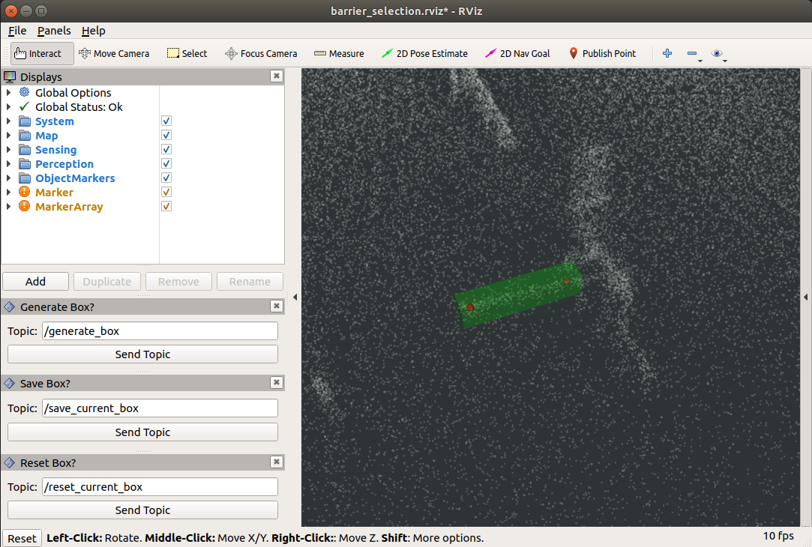
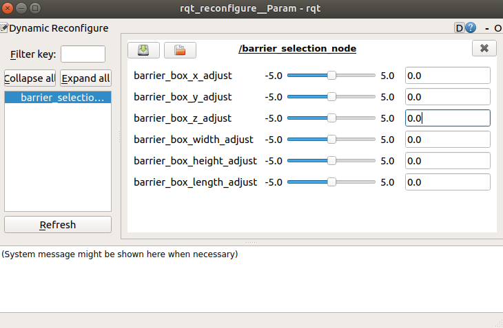

# Barrier Selection
A node to select any points of interest (i.e. barriers) on a map. By publishing points on RViz, one can create a point of interest, then generate a bounding box of the crop area for [pcl_barrier_filter](https://github.com/adastec/barrier_handler/tree/master/barrier_filter) node.


## Instructions
1. ```git clone https://github.com/adastec/barrier_handler.git```
2. Add package to your workspace and build.
3. ```roslaunch barrier_selection barrier_selection.launch```
4. Upon launch, RViz will automatically be opened, map will be loaded depending on which project name is given in launch file. Providing another project name will load its map. rqt_reconfigure window will pop-up.
5. Start selecting points around the POI, any number of points for each barrier can be selected. Selected points will be visualized. Note that there is an option at this point to reset (clear) points if a point is selected by mistake (**Reset Box?** panel).
6. Once done, hit "Send Topic" button under **Generate Box?** topic panel. The box will be visualized as a green transparent box. Note that there is an option at this point to reset (clear) points and the box if there is something wrong with it (**Reset Box?** panel).
7. Once satisfied with the final box, hit "Send Topic" button under **Save Box?** panel. Terminal will also output the actions user takes.
8.  By default, barrier_config.yaml file will be saved under /home and its path will be printed on terminal. Path for the saved yaml file can be changed by passing its argument on terminal (see Examples below). The yaml file includes information about all the generated barriers such as their coordinates, dimensions and ids.
9.  This process is the prerequisite of barrier_filter process.

## Examples
* Launching as is: ```roslaunch barrier_selection barrier_selection.launch```
* Launching with a different path for saved config file: ```roslaunch barrier_selection barrier_selection.launch path_to_save:=/any/path```
* Launching with a different map: ```roslaunch barrier_selection barrier_selection.launch project_name:=ANYPROJECT```

## Screenshots
* Rviz configuration for barrier selection.



* rqt_reconfigure to tweak crop box.


